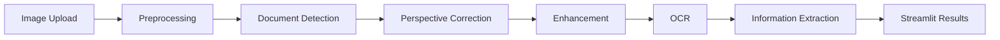

# DocVision AI

**Computer Vision Document Scanner & Intelligence**

DocVision AI turns a phone photo of a paper document into a clean, flattened
scan with extracted text and structured information — all using classic,
CPU-friendly computer vision (no GPU, no heavyweight deep-learning models).

Upload a photo and the app will:

1. Detect the document's boundary in the frame.
2. Find its four corners, even if the photo was taken at an angle.
3. Warp the perspective so the document appears flat and rectangular.
4. Clean it up — denoise, remove shadows, boost contrast, and threshold it
   for readability.
5. Run OCR to extract the text.
6. Pull out common fields (emails, phone numbers, dates, URLs, amounts,
   identifiers) using pattern matching.
7. Show before/after images, the extracted text, the structured fields, and
   real processing statistics — with download buttons for the processed
   image and the extracted text.

---

## Features

- **Robust document detection** — Canny edge detection, contour search,
  polygon approximation, and area filtering, with a graceful fallback when
  no clean four-point contour is found (never crashes on a hard image).
- **Perspective correction** — a classic four-point transform handles
  rotated or angled photos.
- **Enhancement pipeline** — denoising, shadow/illumination correction,
  CLAHE contrast enhancement, and a choice of thresholding methods
  (adaptive Gaussian, adaptive mean, Otsu, or none).
- **OCR** — Tesseract via `pytesseract`, behind a small internal interface
  (`app/ocr/engine.py`) so the backend can be swapped later without
  touching the UI. Reports per-line confidence when available and never
  raises on failure.
- **Information extraction** — regex-based detection of emails, phone
  numbers, dates, URLs, amounts, and identifiers (invoice numbers,
  CNIC-like numbers), clearly labeled as automated pattern matching.
- **Processing analytics** — real, measured processing time, resolutions,
  document area ratio, OCR character count, and fields detected. No faked
  metrics.
- **CPU-first design** — configurable max processing width, lazy OCR
  initialization, Streamlit resource caching, and no GPU-only dependencies.
- **Demo Mode** — three synthetic sample images (clean, perspective
  distorted, low quality) generated on the fly so you can try the full
  pipeline without hunting for a test image.
- **Defensive error handling** — invalid files, tiny images, corrupted
  uploads, unsupported formats, and OCR unavailability all produce a
  friendly message instead of a stack trace.

---

## Architecture



```text
docvision-ai/
├── app/
│   ├── streamlit_app.py       # Streamlit UI and pipeline orchestration
│   ├── cv/
│   │   ├── detector.py        # contour/corner detection + fallback strategy
│   │   ├── perspective.py     # four-point transform
│   │   ├── enhancement.py     # denoise, shadow removal, contrast, threshold
│   │   └── preprocessing.py   # blur + Canny edge detection
│   ├── ocr/
│   │   ├── engine.py          # OCR interface wrapping pytesseract (lazy init)
│   │   └── preprocessing.py   # upscaling/prep for OCR
│   ├── extraction/
│   │   └── entities.py        # regex-based field extraction
│   ├── utils/
│   │   ├── image.py           # decode/encode/resize helpers
│   │   ├── validation.py      # file + image validation
│   │   └── metrics.py         # timing + processing stats
│   └── config/
│       └── settings.py        # loads configs/default.yaml
├── tests/                     # pytest unit tests (no GPU, no network)
├── configs/default.yaml       # default pipeline configuration
├── assets/README.md           # notes on Demo Mode sample images
├── requirements.txt
├── runtime.txt                # Python version pin for Streamlit Cloud
├── packages.txt               # apt package pin (tesseract-ocr) for Streamlit Cloud
└── LICENSE
```

---

## Computer Vision Techniques

- **Canny edge detection** — finds candidate document boundaries; the
  "Detection sensitivity" slider maps to the Canny low/high thresholds.
- **Contour detection & polygon approximation** (`cv2.approxPolyDP`) —
  reduces the largest contours to simple polygons and looks for a
  convex quadrilateral, which naturally handles rotated documents since it
  approximates shape, not axis alignment.
- **Perspective transformation** (`cv2.getPerspectiveTransform` +
  `cv2.warpPerspective`) — maps the four detected corners onto a flat,
  axis-aligned rectangle sized from the longest observed edges.
- **Adaptive thresholding** — `ADAPTIVE_THRESH_GAUSSIAN_C` /
  `ADAPTIVE_THRESH_MEAN_C` / Otsu, chosen per-document since lighting
  varies a lot across phone photos.
- **Image enhancement** — `fastNlMeansDenoising` for noise, a
  background-estimation + division technique for shadow reduction, and
  CLAHE for local contrast.
- **OCR** — Tesseract, an open-source, CPU-only OCR engine well suited to
  printed document text.

---

## Installation

```bash
git clone https://github.com/Mzaq1559/docvision-ai.git
cd docvision-ai
python -m venv .venv
source .venv/bin/activate
pip install -r requirements.txt
```

Tesseract OCR also needs to be installed as a **system package** (it is not
a Python package):

```bash
# Ubuntu/Debian
sudo apt-get update && sudo apt-get install -y tesseract-ocr

# macOS (Homebrew)
brew install tesseract
```

Run the app:

```bash
streamlit run app/streamlit_app.py
```

Run the tests:

```bash
pytest
```

---

## Deployment (Streamlit Community Cloud)

1. Push this repository to GitHub (already done if you're reading this on
   `github.com/Mzaq1559/docvision-ai`).
2. Go to [share.streamlit.io](https://share.streamlit.io) and create a new
   app from this repository.
3. Set:
   - **Repository:** `Mzaq1559/docvision-ai`
   - **Branch:** `main`
   - **Main file path:** `app/streamlit_app.py`
4. Streamlit Cloud automatically installs Python dependencies from
   `requirements.txt`, uses the Python version pinned in `runtime.txt`, and
   installs apt packages listed in `packages.txt` (here: `tesseract-ocr`),
   so OCR works out of the box on the deployed app.
5. Deploy. No secrets or API keys are required for the core pipeline.

If Tesseract is ever unavailable in a given deployment target, the app
detects this at runtime and disables OCR gracefully with a clear message —
detection, perspective correction, and enhancement still work.

---

## Limitations

- **Difficult backgrounds** — cluttered or low-contrast backgrounds (e.g.
  a white document on a white desk) can make contour-based detection less
  reliable; the app falls back to an approximate rectangle or the full
  image rather than failing, but results may need manual cropping.
- **Severely damaged or torn documents** — irregular edges may not reduce
  cleanly to a four-point contour.
- **Handwritten text** — Tesseract is tuned for printed text; handwriting
  recognition accuracy is low.
- **Poor lighting / heavy shadows** — the shadow-reduction step helps but
  cannot fully recover text lost to extreme under/over-exposure.
- **OCR accuracy** — depends heavily on image resolution, font, and
  language; results are not guaranteed to be complete or correct.
- **Extracted fields are automated guesses** — regex-based extraction can
  miss values or produce false positives; always verify against the
  original document.

## Privacy

Uploaded documents may contain sensitive personal information (names,
emails, ID numbers, financial details). In this application:

- Uploaded images are processed in memory for the duration of your
  Streamlit session and are not written to any external database.
- Standard Streamlit Community Cloud hosting still means your file passes
  through Streamlit's infrastructure to run the app; this project does not
  add any additional third-party service calls.
- This project does **not** implement or guarantee automatic deletion of
  session data beyond Streamlit's normal session lifecycle — do not upload
  documents you are not comfortable processing on shared/public
  infrastructure, and avoid deploying this app publicly with real sensitive
  documents without reviewing your own hosting environment's data handling.

## Future Improvements

- Table extraction from scanned documents.
- Handwriting recognition.
- Multilingual OCR (beyond the default `eng` Tesseract language pack).
- Document type classification (invoice, ID card, form, etc.).
- Signature detection.
- Structured invoice understanding (line items, totals).
- LLM-based document Q&A over the extracted text.

---

## Testing Notes

All CV, OCR-interface, and extraction logic is covered by `pytest` unit
tests in `tests/`, using synthetic in-memory images — no GPU and no
external network calls required. OCR *execution* itself (via Tesseract)
was verified manually in the development environment where the Tesseract
binary was available; the OCR engine additionally has explicit unit-level
handling (and is designed to be tested) for the "Tesseract not installed"
case, so the app degrades gracefully wherever OCR is unavailable.
